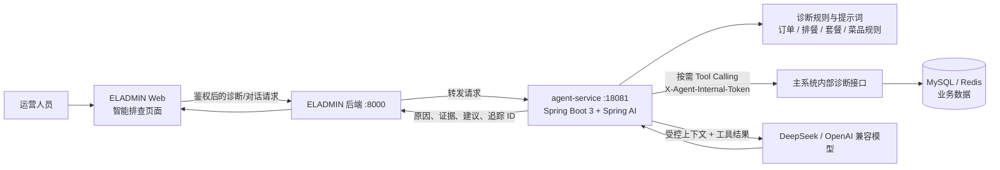

# ELADMIN-MP 餐食运营管理系统

基于 ELADMIN 二次开发的前后端分离后台系统，当前业务重心是客户建档、套餐签约、订单餐数、智能排餐、生产单、配送核销、退餐和销售统计。技术底座为 Spring Boot 2.7.18 + MyBatis-Plus + Spring Security + JWT + Redis + Vue 2.7 + Element UI。

> 原 ELADMIN 通用后台能力仍保留，包括用户、角色、菜单、部门、字典、日志、SQL 监控、定时任务、代码生成、文件存储等。

## 智能排查 Agent

面向“客户某日某餐为什么没有生成排餐”等问题，智能排查 Agent 将主系统中的订单、排餐、套餐、菜品、停送/排除日期、核销和退餐等证据按需汇集，结合诊断规则与大模型输出可核验的原因和下一步处理建议。诊断结果仅作为辅助建议，仍需由客服或运营人员结合证据确认。

### 架构图



### 诊断流程


典型流程为：运营人员输入客户和日期/餐次 → 主系统完成权限校验并转发 → Agent 优先读取基础上下文，再按诊断需要调用订单余额、客户停送日期、排餐详情、候选菜池、套餐规格、核销或退餐记录等工具 → 模型基于规则和证据输出原因、置信度与建议动作；全链路可通过 `X-Request-Id` 关联日志追踪。

### 工具调用说明

工具仅能读取主系统提供的受 Token 保护的内部诊断数据，不直接写入业务数据。模型会根据问题选择调用，且单次诊断默认最多调用 8 次；相同输入会复用本次链路中的结果，避免重复查询。

| 工具 | 用途 |
| --- | --- |
| `getCustomerProfile` / `getCustomerExcludeDates` | 查询客户档案、配送要求、停送日期和排除餐次 |
| `listCustomerOrders` / `getOrderMealBalance` | 判断订单有效性、套餐信息及早餐/午晚餐剩余餐数 |
| `getMealPlan` / `getMealPlanGenerationSnapshot` | 查询指定日期餐次的排餐明细、生成快照与失败原因 |
| `getCandidateDishStats` / `getDishCandidateDetail` | 定位候选菜数量、套餐过滤和过敏/忌口过滤结果 |
| `getPackageSpec` | 校验父子套餐、餐品规格及启用状态 |
| `listVerificationLogs` / `listMealRefunds` | 核对核销、退餐、停餐或退款是否影响餐数与排餐 |

### 本地启动

智能排查由主系统和独立的 `agent-service` 协同运行：先启动主系统，再启动 Agent 服务。主系统仍使用 JDK 8；`agent-service` 需要 JDK 17。

```bash
# 终端 1：启动主系统（JDK 8）
cd eladmin/eladmin-system
JAVA_HOME=/Library/Java/JavaVirtualMachines/jdk-1.8.jdk/Contents/Home \
PATH=/Library/Java/JavaVirtualMachines/jdk-1.8.jdk/Contents/Home/bin:$PATH \
mvn spring-boot:run -Dspring-boot.run.profiles=dev -DskipTests
```

```bash
# 终端 2：启动智能排查服务（JDK 17）
cd agent-service
export AGENT_INTERNAL_TOKEN='请设置与主系统 agent.internal-token 相同的随机密钥'
export AGENT_DEEPSEEK_API_KEY='你的模型 API Key'
mvn spring-boot:run
```

默认地址：主系统 `http://localhost:8000`，Agent 服务 `http://localhost:18081`，健康检查 `http://localhost:18081/api/agent/health`。如使用 OpenAI 兼容服务，可通过 `AGENT_OPENAI_API_KEY`、`AGENT_OPENAI_BASE_URL`、`AGENT_OPENAI_MODEL` 覆盖模型配置；也可使用对应的 `AGENT_DEEPSEEK_*` 环境变量。`AGENT_INTERNAL_TOKEN` 不能为空，且必须与主系统配置保持一致。

## 系统定位

系统围绕餐食交付链路组织业务：

1. 销售录入客户档案和首单，系统生成客户编号和订单编号。
2. 套餐和菜品维护提供排餐所需的商品、规格、菜品线、配料和排期数据。
3. 排餐管理根据有效订单、配送规则、过敏/忌口、排除日期和菜单排期生成每日客户餐单。
4. 生产和配送侧按排餐记录执行送餐。
5. 核销管理记录实际取餐，扣减餐数和餐费余额，并在餐数耗尽时自动完单。
6. 客户用餐统计和排餐日历支持查看剩余餐数、低余量预警和人工调整餐次。

## 核心业务模块

| 模块 | 说明 | 主要入口 |
| --- | --- | --- |
| 客户管理 | 客户档案、地址、孕周、过敏标签、特殊要求、签约套餐、客户编号 | `modules/customer/profile` |
| 套餐管理 | 父套餐、子套餐、编号池、套餐餐数统计 | `modules/customer/pkg`、`modules/customer/numberpool` |
| 订单管理 | 订单生命周期、早餐/午晚餐餐数、金额、排餐模式、开始餐次 | `modules/customer/order` |
| 配菜管理 | 菜品主档、配料字典、配料分类、菜品排期、过敏过滤基础数据 | `modules/meal` |
| 排餐管理 | 生成排餐计划、客户餐单明细、生产单、排餐日历人工调整 | `modules/meal` |
| 核销管理 | 批量核销、核销日志、核销回退、自动完单 | `modules/meal` |
| 退餐管理 | 订单退餐、排餐取消、日志追溯 | `modules/meal` |
| 销售看板 | 客户、订单、销售统计指标 | `modules/sales` |

## 近期演进

从近期提交看，系统主要在以下方向迭代：

- 客户话术建档解析：支持从销售话术中解析客户、地址、套餐、配送和备注信息。
- 客户用餐统计：新增月度用餐统计、低余量预警和固定列宽优化。
- 排餐日历：支持客户维度查看、人工新增/取消餐次、取消未核销排餐、调整日志单独落盘。
- 排餐生成：支持人工新增餐次、开始餐次控制、订单预计剩余餐数、米饭类型和编号明细展示规则。
- 业务文档：补充剩余餐数计算、排餐首次标记、排餐日历调整等说明。

## 技术栈

### 后端

- Java 8
- Spring Boot 2.7.18
- MyBatis-Plus 3.5.3.1
- Spring Security + JWT
- Redis / Lettuce / Redisson
- Druid + p6spy
- MySQL Connector/J 9.2.0
- fastjson2 2.0.54
- Knife4j / Swagger

### 前端

- Vue 2.7.16
- Vue Router 3.x
- Vuex 3.x
- Element UI 2.15.14
- Vue CLI 3 / Webpack 4
- Axios、ECharts、wangeditor

## 目录结构

```text
eladmin-mp/
├── eladmin/                         # 后端 Maven 多模块工程
│   ├── eladmin-common/              # 公共注解、配置、异常、工具类
│   ├── eladmin-logging/             # 操作日志与异常日志
│   ├── eladmin-system/              # 系统启动入口和核心业务模块
│   │   └── src/main/java/me/zhengjie/
│   │       ├── AppRun.java
│   │       └── modules/
│   │           ├── customer/        # 客户、订单、套餐、编号池
│   │           ├── meal/            # 菜品、排餐、核销、退餐
│   │           ├── sales/           # 销售看板
│   │           ├── security/        # 登录认证
│   │           ├── system/          # 用户、角色、菜单等后台能力
│   │           ├── quartz/          # 定时任务
│   │           └── maint/           # 运维管理
│   ├── eladmin-tools/               # 邮件、存储、支付宝等工具模块
│   ├── eladmin-generator/           # 代码生成器
│   ├── doc/
│   │   ├── business/                # 业务说明文档
│   │   └── apidoc/                  # 接口 Markdown 文档
│   └── sql/                         # 业务表结构和数据脚本
├── eladmin-web/                     # Vue 前端工程
│   └── src/views/
│       ├── customer/                # 客户、订单、套餐、统计页面
│       ├── meal/                    # 菜品、排餐、生产单、核销页面
│       ├── system/                  # 系统管理页面
│       └── maint/                   # 运维页面
├── docker/                          # 后端 JAR + 前端 Nginx 容器部署
├── sql/                             # 基础库表和迁移脚本
└── doc/                             # 根目录规划/移动端等补充文档
```

## 本地开发

### 环境准备

- JDK 8
- Maven 3.x
- Node.js 16 或兼容 Vue CLI 3 的版本
- MySQL
- Redis

前端脚本已内置 `NODE_OPTIONS=--openssl-legacy-provider`，可兼容较新的 Node.js OpenSSL 行为。

### 后端启动

```bash
cd eladmin

# 构建后端所有模块
mvn clean install -DskipTests

# 方式一：打包后运行
java -jar eladmin-system/target/eladmin-system-1.1.jar --spring.profiles.active=dev

# 方式二：开发期直接运行启动类
mvn -pl eladmin-system spring-boot:run -Dspring-boot.run.profiles=dev
```

默认后端端口为 `8000`，配置文件位于：

- `eladmin/eladmin-system/src/main/resources/config/application.yml`
- `eladmin/eladmin-system/src/main/resources/config/application-dev.yml`
- `eladmin/eladmin-system/src/main/resources/config/application-prod.yml`

Redis 支持通过环境变量覆盖：

```bash
REDIS_HOST=127.0.0.1
REDIS_PORT=6379
REDIS_PWD=
REDIS_DB=1
```

开发环境登录和验证码请使用本地私有配置或初始化数据，不要把真实凭据提交到仓库。

### 前端启动

```bash
cd eladmin-web

npm install
npm run dev
```

默认前端端口为 `8013`，代理和端口配置见 `eladmin-web/vue.config.js`，环境变量见 `eladmin-web/.env.*`。

### 构建

```bash
# 后端
cd eladmin
mvn clean package -DskipTests

# 前端生产包
cd ../eladmin-web
npm run build:prod
```

### Docker 部署

```bash
cd docker
cp .env.example .env
# 按环境修改 .env 中的数据库、Redis、JWT 等配置
docker compose up -d --build
```

容器部署中前端默认暴露 `18080`，后端在 Docker 网络内监听 `8000`，由前端 Nginx 代理访问。

## 测试

后端 `pom.xml` 中 Surefire 默认配置为跳过测试。需要显式开启：

```bash
cd eladmin
mvn test -DskipTests=false

# 指定测试类
mvn -Dtest=CustomerProfileServiceImplTest test -DskipTests=false
```

前端：

```bash
cd eladmin-web
npm run lint
npm run test:unit
```

单元测试新增的数据必须在 `@After` / `@AfterEach` 或测试前置清理中删除，且只能删除当前测试创建的数据，避免误删业务数据或其他测试数据。

## 业务文档索引

修改业务逻辑前先阅读对应业务文档，变更后同步更新。

- [客户管理业务说明](eladmin/doc/business/客户管理业务说明.md)
- [套餐管理业务说明](eladmin/doc/business/套餐管理业务说明.md)
- [订单管理业务说明](eladmin/doc/business/订单管理业务说明.md)
- [配菜管理业务说明](eladmin/doc/business/配菜管理业务说明.md)
- [排餐管理业务说明](eladmin/doc/business/排餐管理业务说明.md)
- [核销管理业务说明](eladmin/doc/business/核销管理业务说明.md)
- [客户话术建档解析草稿规则](eladmin/doc/business/客户话术建档解析草稿规则.md)

## 接口文档索引

运行时 Knife4j 地址为 `/doc.html`。新增或修改接口时，同时更新 `eladmin/doc/apidoc/` 下的 Markdown 文档。

- [客户档案管理接口文档](eladmin/doc/apidoc/客户档案管理接口文档.md)
- [客户订单管理接口文档](eladmin/doc/apidoc/客户订单管理接口文档.md)
- [客户用餐统计页面接口文档](eladmin/doc/apidoc/客户用餐统计页面接口文档.md)
- [父套餐餐数统计接口](eladmin/doc/apidoc/父套餐餐数统计接口.md)
- [菜品管理接口文档](eladmin/doc/apidoc/菜品管理接口文档.md)
- [排餐计划接口文档](eladmin/doc/apidoc/排餐计划接口文档.md)
- [排餐计划生成接口](eladmin/doc/apidoc/排餐计划生成接口.md)
- [订单排餐日历接口文档](eladmin/doc/apidoc/订单排餐日历接口文档.md)
- [核销管理接口文档](eladmin/doc/apidoc/核销管理接口文档.md)
- [退餐管理接口](eladmin/doc/apidoc/退餐管理接口.md)

## 关键规则

- JSON 序列化使用 fastjson2，项目中已排除 Jackson 默认 JSON 依赖。
- MyBatis-Plus Mapper XML 位于 `eladmin/eladmin-system/src/main/resources/mapper/`。
- 新增或修改方法时补充清晰方法注释，说明用途、关键参数和返回含义。
- 新增数据库实体字段时添加字段注释，说明业务含义。
- 业务逻辑变更必须同步更新 `eladmin/doc/business/`。
- API 变更必须同步更新 `eladmin/doc/apidoc/`。
- 数据库排查不要使用 Docker 进入容器查询，优先使用本地工具或脚本直连。
- 提交信息使用中文描述，type 使用英文，例如：`feat: 新增套餐编号池功能`。

## 常用入口

| 类型 | 地址/文件 |
| --- | --- |
| 后端启动类 | `eladmin/eladmin-system/src/main/java/me/zhengjie/AppRun.java` |
| 后端配置 | `eladmin/eladmin-system/src/main/resources/config/` |
| 前端配置 | `eladmin-web/vue.config.js`、`eladmin-web/.env.*` |
| API 在线文档 | `http://localhost:8000/doc.html` |
| Druid 监控 | `http://localhost:8000/druid/` |
| 前端本地服务 | `http://localhost:8013/` |

## License

本项目基于 ELADMIN 二次开发，原始项目遵循 Apache License 2.0。业务定制代码请按当前仓库约定使用。
