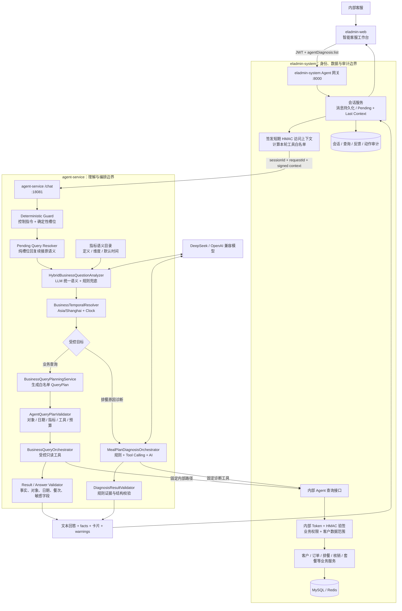

# ELADMIN-MP 餐食运营管理系统

基于 ELADMIN 二次开发的前后端分离后台系统，当前业务重心是客户建档、套餐签约、订单餐数、智能排餐、生产单、配送核销、退餐、销售统计和智能客服。主系统技术底座为 Spring Boot 2.7.18 + MyBatis-Plus + Spring Security + JWT + Redis + Vue 2.7 + Element UI，独立 Agent 编排服务使用 Spring Boot 3.5.14 + Spring AI 1.1.6。

> 原 ELADMIN 通用后台能力仍保留，包括用户、角色、菜单、部门、字典、日志、SQL 监控、定时任务、代码生成、文件存储等。

## 智能客服 Agent

当前 Agent 已从单一“排餐未生成诊断”扩展为内部客服工作台，包含两条受控链路：

- **排餐原因诊断**：回答“B3303 今天午餐为什么没排上”等问题，结合版本化规则、业务证据和大模型给出原因、置信度、证据与建议动作。
- **全业务只读查询**：查询客户、订单、剩余餐数、排餐、公共菜单、实际过敏过滤、核销、退餐、套餐、菜品、业务规则和已登记运营指标。

`eladmin-system` 始终是业务数据和权限的唯一真相源；`agent-service` 只负责语义理解、受控规划、工具编排和结果校验，不直连业务数据库。功能仅面向已登录的内部客服，不作为外部客户机器人开放。

### 当前架构



### 组件职责

| 组件 | 核心职责 |
| --- | --- |
| `eladmin-web` | 会话列表、追问与澄清、诊断证据、事实引用、业务卡片、部分失败提示、反馈和动作确认交互 |
| `eladmin-system` | 登录鉴权、Pending/Last Context 持久化、HMAC 上下文签发、工具权限映射、客户数据范围、真实业务查询和审计 |
| `agent-service` | 确定性槽位、Pending 续接、业务时间落地、QueryPlan 编译与校验、只读工具编排、事实和回答校验 |
| 大模型 | 选择业务领域、登记指标、时间语义、交互模式和歧义；不能生成 SQL、URL、任意工具名、结果字段或直接修改业务数据 |

### 请求处理流程

1. 客服从前端调用主系统统一聊天接口，主系统校验 `agentDiagnosis:list`，保存用户消息并生成 `requestId`。
2. 主系统根据当前用户权限和部门数据范围计算本轮可用工具，签发绑定 `sessionId`、`requestId`、客服身份和过期时间的 HMAC 访问上下文。
3. `agent-service` 先处理控制指令并提取确定性槽位。若主系统下发 Pending Context 且本轮只是日期、餐次或编号，则只补槽并恢复原指标，不重新猜测业务领域。
4. 其他业务问题由 LLM 结合版本化指标目录输出领域、指标和时间枚举；规则仅在模型不可用、非法或低置信度时兜底。`BusinessTemporalResolver` 再按 `Asia/Shanghai` 和可注入 `Clock` 将相对时间落为日期。
5. 受控语义被编译为 QueryPlan；服务端校验领域、动作、指标、维度、过滤条件、工具白名单、日期范围和调用预算。指标的响应类型、标签、结果字段和工具均来自目录，不读取原始中文二次路由。
6. Agent 仅调用登记过的内部只读工具。主系统内部接口再次校验身份、业务权限和客户数据范围，然后复用真实业务 Service 计算结果。
7. 工具结果转换为 facts 并校验对象、日期、餐次、数字和敏感字段。成功、重置、目标切换或超时会清除 Pending；Last Context 与脱敏语义追踪写回主系统。

排餐原因诊断沿用独立诊断编排器：模型可在规则约束下按需调用客户档案、订单余额、停送日期、排餐快照、套餐规格、候选菜、核销和退餐等诊断工具，最终输出经过规则证据校验的结构化原因。

### 受控查询能力

| 领域 | 当前能力 | 主要只读工具 |
| --- | --- | --- |
| 客户 | 客户候选、综合概览、地址摘要、过敏标签、剩余餐数 | `resolveCustomer`、`customerOverview` |
| 订单 | 客户订单列表、订单详情、有效状态和餐数余额 | `listOrders`、`orderDetail` |
| 排餐 | 客户实际排餐、跨客户单日排餐、实际过敏过滤、排餐失败 | `listMealPlans`、`getMealPlanFailureSummary` |
| 菜单与菜品 | 午晚餐公共排期、客户候选菜、菜品与配料摘要 | `listScheduledDishes`、`previewDishCandidates`、`listDishes` |
| 核销与退餐 | 客户或订单核销记录、退餐记录 | `listVerifications`、`listRefunds` |
| 套餐与规则 | 父子套餐规格、版本化业务规则解释 | `packageDetail`、`explainRule` |
| 运营统计 | 客户档案总数、当日应服务/已排餐/待排餐/已核销/待核销客户、活跃客户、到期订单 | `getCustomerProfileCount`、`getDailyCustomerWorkload`、`getActiveCustomerSummary`、`getExpiringOrderSummary` |

复杂组合问答、更多统计维度、真实模型旁路评测和灰度上线仍需持续收敛；Pending/Last Context 已由主系统持久化，Agent 重启或实例切换后可继续纯槽位补充。

### 安全与写操作边界

- 业务查询工具全部标记为 `INTERNAL_READ_ONLY`，Agent 不直连数据库、不执行自由 SQL，订单金额及相关金额字段默认不进入 DTO、模型上下文、回答或审计。
- 页面入口权限、业务工具权限和部门数据范围分别校验；仅有 Agent 菜单权限不等于拥有客户、订单、排餐或菜品数据权限。
- 通用业务查询单轮最多调用 6 个工具、预留最多 100 条数据；排餐诊断默认最多调用 8 次工具。同参结果仅在当前请求内缓存。
- 工具失败、权限不足、结果截断或 QueryPlan 与结果不一致时返回受控 warning，不能把部分结果表述为完整结论。
- 排餐诊断可以根据固定原因码生成动作草稿，但模型不能直接执行。动作必须由人工调用确认接口，并经过独立权限、幂等键、业务数据过期检查和高风险二次确认；业务只读问答链路不生成可执行动作。

### 本地启动

当前主系统 `pom.xml` 和 `agent-service` 均使用 Java 17，但两者保持独立 Maven 工程和 Spring Boot 依赖基线。先启动主系统，再启动 Agent 服务和前端。

```bash
# 终端 1：主系统（JDK 17）
cd eladmin/eladmin-system
export AGENT_INTERNAL_TOKEN='主系统与 agent-service 共用的随机密钥'
export AGENT_ACCESS_CONTEXT_SECRET='至少 32 位的 HMAC 随机密钥'
source ~/.zshrc && jenv shell 17 && mvn399
mvn -q spring-boot:run -DskipTests
```

```bash
# 终端 2：Agent 服务（JDK 17）
cd agent-service
export AGENT_INTERNAL_TOKEN='与主系统相同的随机密钥'
export AGENT_DEEPSEEK_API_KEY='模型 API Key'
export AGENT_CONTEXT_BASE_URL='http://localhost:8000'
source ~/.zshrc && jenv shell 17 && mvn399
mvn -q spring-boot:run
```

```bash
# 终端 3：前端
cd eladmin-web
NODE_OPTIONS=--openssl-legacy-provider BROWSER=none ./node_modules/.bin/vue-cli-service serve --port 8013 --open false
```

默认地址：前端 `http://localhost:8013`，主系统 `http://localhost:8000`，Agent 服务 `http://localhost:18081`，Agent 健康检查 `http://localhost:18081/api/agent/health`。

模型配置优先读取 `AGENT_DEEPSEEK_API_KEY`、`AGENT_DEEPSEEK_BASE_URL`、`AGENT_DEEPSEEK_MODEL`。统一语义配置包括 `AGENT_CHAT_BUSINESS_SEMANTIC_MODE`、`AGENT_CHAT_BUSINESS_SEMANTIC_CONFIDENCE_THRESHOLD`、`AGENT_CHAT_PENDING_CONTEXT_ENABLED`、`AGENT_CHAT_PENDING_CONTEXT_TTL_MINUTES` 和 `AGENT_BUSINESS_TIME_ZONE_ID`，默认业务时区为 `Asia/Shanghai`。

## 系统定位

系统围绕餐食交付链路组织业务：

1. 销售录入客户档案和首单，系统生成客户编号和订单编号。
2. 套餐和菜品维护提供排餐所需的商品、规格、菜品线、配料和排期数据。
3. 排餐管理根据有效订单、配送规则、过敏/忌口、排除日期和菜单排期生成每日客户餐单。
4. 生产和配送侧按排餐记录执行送餐。
5. 核销管理记录实际取餐，扣减餐数和餐费余额，并在餐数耗尽时自动完单。
6. 客户用餐统计和排餐日历支持查看剩余餐数、低余量预警和人工调整餐次。

## 核心业务模块

| 模块 | 说明 | 主要入口 |
| --- | --- | --- |
| 客户管理 | 客户档案、地址、孕周、过敏标签、特殊要求、签约套餐、客户编号 | `modules/customer/profile` |
| 套餐管理 | 父套餐、子套餐、编号池、套餐餐数统计 | `modules/customer/pkg`、`modules/customer/numberpool` |
| 订单管理 | 订单生命周期、早餐/午晚餐餐数、金额、排餐模式、开始餐次 | `modules/customer/order` |
| 配菜管理 | 菜品主档、配料字典、配料分类、菜品排期、过敏过滤基础数据 | `modules/meal` |
| 排餐管理 | 生成排餐计划、客户餐单明细、生产单、排餐日历人工调整 | `modules/meal` |
| 核销管理 | 批量核销、核销日志、核销回退、自动完单 | `modules/meal` |
| 退餐管理 | 订单退餐、排餐取消、日志追溯 | `modules/meal` |
| 销售看板 | 客户、订单、销售统计指标 | `modules/sales` |
| 智能客服 Agent | 排餐诊断、全业务只读问答、会话与查询审计、人工确认动作 | `modules/agent`、`agent-service`、`views/agent` |

## 近期演进

从近期提交看，系统主要在以下方向迭代：

- 客户话术建档解析：支持从销售话术中解析客户、地址、套餐、配送和备注信息。
- 客户用餐统计：新增月度用餐统计、低余量预警和固定列宽优化。
- 排餐日历：支持客户维度查看、人工新增/取消餐次、取消未核销排餐、调整日志单独落盘。
- 排餐生成：支持人工新增餐次、开始餐次控制、订单预计剩余餐数、米饭类型和编号明细展示规则。
- 智能客服 Agent：从排餐原因诊断扩展到客户、订单、排餐、核销、退餐、套餐、菜品和运营统计的受控只读查询。
- Agent 语义架构：引入模型优先、规则兜底的业务问题分析器，服务端将受控语义编译为 QueryPlan，并支持追问、局部改查和结果纠错重新规划。
- Agent 安全链路：新增 HMAC 客服访问上下文、工具权限白名单、部门数据范围、调用与数据预算、facts 引用、结果一致性校验和查询审计。
- Agent 结果校验：QueryPlan 与工具结果按客户、订单、业务日期和餐次核对；业务日期兼容 `yyyy-MM-dd` 与主系统的零点日期时间格式，避免同日结果被误判为不一致。
- Agent 统一语义：指标知识目录集中维护业务定义、默认时间、展示名、结果字段和工具映射；相对时间由模型输出枚举、服务端按固定时区解析。
- Agent 跨实例续接：主系统持久化 Pending/Last Business Context，纯槽位回复恢复原 QueryPlan 语义，避免补“今天”后漂移到公共菜单。
- 业务文档：补充剩余餐数计算、排餐首次标记、排餐日历调整等说明。

## 技术栈

### 后端

- Java 17
- Spring Boot 2.7.18
- MyBatis-Plus 3.5.3.1
- Spring Security + JWT
- Redis / Lettuce / Redisson
- Druid + p6spy
- MySQL Connector/J 9.2.0
- fastjson2 2.0.54
- Knife4j / Swagger

### Agent 服务

- Java 17
- Spring Boot 3.5.14
- Spring AI 1.1.6
- DeepSeek / OpenAI 兼容 Chat API
- 受控 QueryPlan、Tool Calling、规则注册表、结构化输出与回答校验
- 独立 Maven 工程，与主系统依赖和发布节奏隔离

### 前端

- Vue 2.7.16
- Vue Router 3.x
- Vuex 3.x
- Element UI 2.15.14
- Vue CLI 3 / Webpack 4
- Axios、ECharts、wangeditor

## 目录结构

```text
eladmin-mp/
├── eladmin/                         # 后端 Maven 多模块工程
│   ├── eladmin-common/              # 公共注解、配置、异常、工具类
│   ├── eladmin-logging/             # 操作日志与异常日志
│   ├── eladmin-system/              # 系统启动入口和核心业务模块
│   │   └── src/main/java/me/zhengjie/
│   │       ├── AppRun.java
│   │       └── modules/
│   │           ├── agent/           # Agent 网关、内部工具、权限、会话、审计、动作确认
│   │           ├── customer/        # 客户、订单、套餐、编号池
│   │           ├── meal/            # 菜品、排餐、核销、退餐
│   │           ├── sales/           # 销售看板
│   │           ├── security/        # 登录认证
│   │           ├── system/          # 用户、角色、菜单等后台能力
│   │           ├── quartz/          # 定时任务
│   │           └── maint/           # 运维管理
│   ├── eladmin-tools/               # 邮件、存储、支付宝等工具模块
│   ├── eladmin-generator/           # 代码生成器
│   ├── doc/
│   │   ├── business/                # 业务说明文档
│   │   └── apidoc/                  # 接口 Markdown 文档
│   └── sql/                         # 业务表结构和数据脚本
├── agent-service/                   # 独立智能客服编排服务（JDK 17）
│   ├── rules/                       # 诊断规则、提示词策略和建议模板
│   └── src/main/java/me/zhengjie/agent/
│       ├── analysis/                # 语义目录、LLM/规则分析、业务时间解析
│       ├── chat/                    # 会话状态、槽位和顶层路由
│       ├── orchestrator/            # 排餐诊断编排
│       ├── query/                   # QueryPlan、工具编排、facts 和回答校验
│       ├── tool/                    # 排餐诊断工具注册
│       └── validator/               # 诊断结构与规则证据校验
├── eladmin-web/                     # Vue 前端工程
│   └── src/views/
│       ├── agent/                   # 智能客服工作台与结构化业务卡片
│       ├── customer/                # 客户、订单、套餐、统计页面
│       ├── meal/                    # 菜品、排餐、生产单、核销页面
│       ├── system/                  # 系统管理页面
│       └── maint/                   # 运维页面
├── docker/                          # 后端 JAR + 前端 Nginx 容器部署
├── sql/                             # 基础库表和迁移脚本
└── doc/                             # 根目录规划/移动端等补充文档
```

## 本地开发

### 环境准备

- JDK 17（主系统和 `agent-service`）
- Maven 3.9.9
- Node.js 16 或兼容 Vue CLI 3 的版本
- MySQL
- Redis

前端脚本已内置 `NODE_OPTIONS=--openssl-legacy-provider`，可兼容较新的 Node.js OpenSSL 行为。

### 后端启动

```bash
cd eladmin
source ~/.zshrc && jenv shell 17 && mvn399

# 构建后端所有模块
mvn clean install -DskipTests

# 方式一：打包后运行
java -jar eladmin-system/target/eladmin-system-1.1.jar --spring.profiles.active=dev

# 方式二：开发期直接运行启动类
mvn -pl eladmin-system spring-boot:run -Dspring-boot.run.profiles=dev
```

默认后端端口为 `8000`，配置文件位于：

- `eladmin/eladmin-system/src/main/resources/config/application.yml`
- `eladmin/eladmin-system/src/main/resources/config/application-dev.yml`
- `eladmin/eladmin-system/src/main/resources/config/application-prod.yml`

Redis 支持通过环境变量覆盖：

```bash
REDIS_HOST=127.0.0.1
REDIS_PORT=6379
REDIS_PWD=
REDIS_DB=1
```

开发环境登录和验证码请使用本地私有配置或初始化数据，不要把真实凭据提交到仓库。

### 前端启动

```bash
cd eladmin-web

npm install
npm run dev
```

默认前端端口为 `8013`，代理和端口配置见 `eladmin-web/vue.config.js`，环境变量见 `eladmin-web/.env.*`。

### 构建

```bash
# 后端
cd eladmin
source ~/.zshrc && jenv shell 17 && mvn399
mvn clean package -DskipTests

# Agent 服务（JDK 17）
cd ../agent-service
source ~/.zshrc && jenv shell 17 && mvn399
mvn clean package -DskipTests

# 前端生产包
cd ../eladmin-web
npm run build:prod
```

### Docker 部署

```bash
cd docker
cp .env.example .env
# 按环境修改 .env 中的数据库、Redis、JWT 等配置
docker compose up -d --build
```

容器部署中前端默认暴露 `18080`，后端在 Docker 网络内监听 `8000`，由前端 Nginx 代理访问。

## 测试

后端 `pom.xml` 中 Surefire 默认配置为跳过测试。需要显式开启：

```bash
cd eladmin
source ~/.zshrc && jenv shell 17 && mvn399
mvn test -DskipTests=false

# 指定测试类
mvn -Dtest=CustomerProfileServiceImplTest test -DskipTests=false
```

`agent-service` 的测试不默认跳过，使用 JDK 17 + Maven 3.9.9：

```bash
cd agent-service
source ~/.zshrc && jenv shell 17 && mvn399
mvn -q test

# Agent 查询响应定向测试
mvn -q -Dtest=BusinessQueryResponseFactoryTest test
```

前端：

```bash
cd eladmin-web
npm run lint
npm run test:unit
```

单元测试新增的数据必须在 `@After` / `@AfterEach` 或测试前置清理中删除，且只能删除当前测试创建的数据，避免误删业务数据或其他测试数据。

## 业务文档索引

修改业务逻辑前先阅读对应业务文档，变更后同步更新。

- [客户管理业务说明](eladmin/doc/business/客户管理业务说明.md)
- [套餐管理业务说明](eladmin/doc/business/套餐管理业务说明.md)
- [订单管理业务说明](eladmin/doc/business/订单管理业务说明.md)
- [配菜管理业务说明](eladmin/doc/business/配菜管理业务说明.md)
- [排餐管理业务说明](eladmin/doc/business/排餐管理业务说明.md)
- [核销管理业务说明](eladmin/doc/business/核销管理业务说明.md)
- [客户话术建档解析草稿规则](eladmin/doc/business/客户话术建档解析草稿规则.md)
- [智能排查 Agent 服务设计方案](eladmin/doc/智能排查Agent服务设计方案.md)
- [智能客服 Agent 全业务只读查询能力实施任务清单](eladmin/doc/智能客服Agent全业务只读查询能力实施任务清单.md)
- [智能客服 Agent 全业务问答剩余任务实施计划](eladmin/doc/智能客服Agent全业务问答剩余任务实施计划.md)
- [智能客服 Agent 自然语言理解与查询纠错优化实施方案](eladmin/doc/智能客服Agent自然语言理解与查询纠错优化实施方案.md)
- [智能客服 Agent 统一语义分析与时间口径实施计划](eladmin/doc/智能客服Agent统一语义分析与时间口径实施计划.md)

## 接口文档索引

运行时 Knife4j 地址为 `/doc.html`。新增或修改接口时，同时更新 `eladmin/doc/apidoc/` 下的 Markdown 文档。

- [客户档案管理接口文档](eladmin/doc/apidoc/客户档案管理接口文档.md)
- [客户订单管理接口文档](eladmin/doc/apidoc/客户订单管理接口文档.md)
- [客户用餐统计页面接口文档](eladmin/doc/apidoc/客户用餐统计页面接口文档.md)
- [父套餐餐数统计接口](eladmin/doc/apidoc/父套餐餐数统计接口.md)
- [菜品管理接口文档](eladmin/doc/apidoc/菜品管理接口文档.md)
- [排餐计划接口文档](eladmin/doc/apidoc/排餐计划接口文档.md)
- [排餐计划生成接口](eladmin/doc/apidoc/排餐计划生成接口.md)
- [订单排餐日历接口文档](eladmin/doc/apidoc/订单排餐日历接口文档.md)
- [核销管理接口文档](eladmin/doc/apidoc/核销管理接口文档.md)
- [退餐管理接口](eladmin/doc/apidoc/退餐管理接口.md)
- [智能客服 Agent 内部业务查询接口](eladmin/doc/apidoc/智能客服Agent内部业务查询接口文档.md)

## 关键规则

- JSON 序列化使用 fastjson2，项目中已排除 Jackson 默认 JSON 依赖。
- MyBatis-Plus Mapper XML 位于 `eladmin/eladmin-system/src/main/resources/mapper/`。
- 新增或修改方法时补充清晰方法注释，说明用途、关键参数和返回含义。
- 新增数据库实体字段时添加字段注释，说明业务含义。
- 业务逻辑变更必须同步更新 `eladmin/doc/business/`。
- API 变更必须同步更新 `eladmin/doc/apidoc/`。
- 数据库排查不要使用 Docker 进入容器查询，优先使用本地工具或脚本直连。
- 提交信息使用中文描述，type 使用英文，例如：`feat: 新增套餐编号池功能`。

## 常用入口

| 类型 | 地址/文件 |
| --- | --- |
| 后端启动类 | `eladmin/eladmin-system/src/main/java/me/zhengjie/AppRun.java` |
| 后端配置 | `eladmin/eladmin-system/src/main/resources/config/` |
| Agent 服务启动类 | `agent-service/src/main/java/me/zhengjie/agent/AgentServiceApplication.java` |
| Agent 服务配置 | `agent-service/src/main/resources/application.yml` |
| Agent 工作台 | `eladmin-web/src/views/agent/diagnosis/index.vue` |
| Agent 统一聊天接口 | `POST /api/agent/meal-plan/chat` |
| Agent 会话接口 | `/api/agent/chat-sessions` |
| Agent 内部只读查询 | `/api/internal/agent/query/*`、`/api/internal/agent/operations/*` |
| 前端配置 | `eladmin-web/vue.config.js`、`eladmin-web/.env.*` |
| API 在线文档 | `http://localhost:8000/doc.html` |
| Agent 健康检查 | `http://localhost:18081/api/agent/health` |
| Druid 监控 | `http://localhost:8000/druid/` |
| 前端本地服务 | `http://localhost:8013/` |

## License

本项目基于 ELADMIN 二次开发，原始项目遵循 Apache License 2.0。业务定制代码请按当前仓库约定使用。
