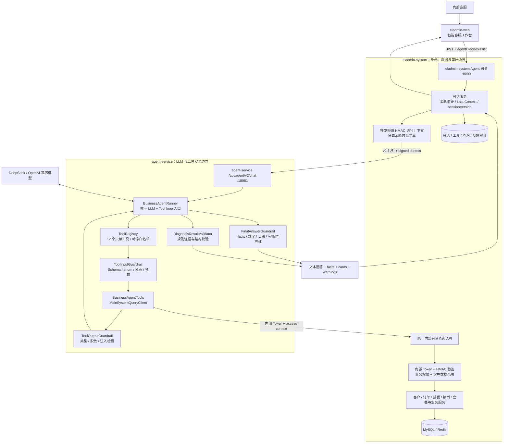

# ELADMIN-MP 餐食运营管理系统

基于 ELADMIN 二次开发的前后端分离后台系统，当前业务重心是客户建档、套餐签约、订单餐数、智能排餐、生产单、配送核销、退餐、销售统计和智能客服。主系统技术底座为 Spring Boot 2.7.18 + MyBatis-Plus + Spring Security + JWT + Redis + Vue 2.7 + Element UI，独立 Agent 编排服务使用 Spring Boot 3.5.14 + Spring AI 1.1.6。

> 原 ELADMIN 通用后台能力仍保留，包括用户、角色、菜单、部门、字典、日志、SQL 监控、定时任务、代码生成、文件存储等。

## 智能客服 Agent

当前 Agent 是面向内部客服的只读工作台，包含两类能力，并由同一个 LLM Tool Calling 循环驱动：

- **排餐原因诊断**：回答“B3303 今天午餐为什么没排上”等问题，结合版本化规则、业务证据和大模型给出原因、置信度、证据与建议动作。
- **全业务只读查询**：查询客户、订单、剩余餐数、排餐、公共菜单、实际过敏过滤、核销、退餐、套餐、菜品、业务规则和已登记运营指标。

`eladmin-system` 是业务数据、身份权限和数据范围的唯一真相源；`agent-service` 只通过主系统统一只读 API 获取数据，不连接数据库。模型负责理解问题、选择和组合工具、澄清与生成回答，Java 负责工具供给、鉴权上下文、参数约束、预算、脱敏、审计、事实校验和安全降级。功能仅面向已登录的内部客服，不作为外部客户机器人开放。

### 当前架构


```mermaid
flowchart TB
    U["内部客服"] --> W["eladmin-web\n智能客服工作台"]
    W -->|"JWT + agentDiagnosis:list"| G["eladmin-system Agent 网关\n:8000"]

    subgraph MAIN["eladmin-system：身份、数据与审计边界"]
        G --> S["会话服务\n消息摘要 / Last Context / sessionVersion"]
        S --> H["签发短期 HMAC 访问上下文\n计算本轮可见工具"]
        IQ["统一内部只读查询 API"] --> P["内部 Token + HMAC 验签\n业务权限 + 客户数据范围"]
        P --> BS["客户 / 订单 / 排餐 / 核销 / 套餐等业务服务"]
        BS --> DB[("MySQL / Redis")]
        S --> AU[("会话 / 工具 / 查询 / 反馈审计")]
    end

    H -->|"v2 信封 + signed context"| C["agent-service /api/agent/v2/chat\n:18081"]

    subgraph AGENT["agent-service：LLM 与工具安全边界"]
        C --> R["BusinessAgentRunner\n唯一 LLM + Tool loop 入口"]
        R --> REG["ToolRegistry\n12 个只读工具 / 动态白名单"]
        REG --> IN["ToolInputGuardrail\nSchema / enum / 分页 / 预算"]
        IN --> BT["BusinessAgentTools\nMainSystemQueryClient"]
        BT --> OUT["ToolOutputGuardrail\n类型 / 脱敏 / 注入检测"]
        OUT --> R
        R --> FA["FinalAnswerGuardrail\nfacts / 数字 / 日期 / 写操作声称"]
        R --> DV["DiagnosisResultValidator\n规则证据与结构校验"]
    end

    BT -->|"内部 Token + access context"| IQ
    FA --> RESP["文本回答 + facts + cards + warnings"]
    DV --> RESP
    RESP --> S
    S --> W
    L["DeepSeek / OpenAI 兼容模型"] <--> R
```

### 组件职责

| 组件 | 核心职责 |
| --- | --- |
| `eladmin-web` | 会话列表、追问与澄清、诊断证据、事实引用、业务卡片、部分失败提示、反馈和动作确认交互 |
| `eladmin-system` | 登录鉴权、会话摘要、HMAC 上下文签发、本轮工具白名单、客户数据范围、统一只读查询、审计和人工动作确认 |
| `agent-service` | `BusinessAgentRunner`、动态工具注册、强类型输入输出、三层护栏、工具预算、事实/卡片组装和安全降级 |
| `ToolRegistry` | 维护工具名、描述、输入输出类型、所需权限、结果上限、超时和卡片类型的唯一登记 |
| 大模型 | 理解问题、选择和组合当前可见工具、决定澄清或回答；不能生成 SQL、URL、权限字段、任意工具名或直接修改业务数据 |

### 请求处理流程

1. 客服从前端调用主系统统一聊天入口，主系统校验 `agentDiagnosis:list`，保存用户消息并生成 `requestId`。
2. 主系统根据当前用户权限和部门数据范围计算本轮 `availableTools`，生成包含消息、会话摘要、工具白名单和 `sessionVersion` 的 v2 信封，并签发短期 `X-Agent-Access-Context`。
3. `BusinessAgentRunner` 只向模型暴露本轮白名单工具、业务上下文和安全提示；问候、澄清等场景可以不调用工具，涉及实时业务事实时必须调用成功工具。
4. 模型通过 Spring AI `ToolCallAdvisor` 自主选择和组合工具。Java 不再根据中文关键词、领域枚举、`ChatIntent` 或 `QueryPlan` 固定选择业务工具。
5. 每次调用先经过输入护栏，再由主系统统一只读 API 执行；主系统重新校验内部关联 ID、业务权限、部门数据范围和对象关系，并在 SQL 查询前完成分页与数据裁剪。
6. 工具结果经过输出护栏后返回模型。模型可继续调用、请求澄清或生成回答；相同工具和规范化参数在当前请求内命中缓存，调用次数、模型轮次和记录数受硬预算限制。
7. 最终回答经过事实、敏感数据和写操作声称校验，确定性生成 `facts`、业务 `cards`、`warnings` 和 `toolTraceSummary`，再通过 `conversationPatch` 回写主系统会话。

排餐原因诊断复用同一套领域工具。`rules/{scene}/` 仍是规则真相源，规则只声明原因、证据字段和 `requiredTools`；最终结果必须通过规则 ID/版本、工具事实、原因码、置信度和建议动作校验。

### 统一只读工具

第一期固定为 12 个工具，工具名、Schema、权限和结果上限只在 `agent-service/src/main/java/me/zhengjie/agent/tool/ToolRegistry.java` 登记一次：

| 工具 | 能力 |
| --- | --- |
| `searchCustomerProfiles` | 客户档案和未下单客户分页查询 |
| `searchServiceCustomers` | 以订单为根的服务客户分页查询；同一客户多笔订单逐笔返回 |
| `getServiceCustomerDetail` | 单个客户或订单的档案、订单、套餐、餐数池和最近记录快照 |
| `listMealPlans` | 客户/订单排餐和菜品明细查询 |
| `listVerifications` | 客户/订单核销记录查询 |
| `listRefunds` | 客户/订单退餐记录查询 |
| `previewDishCandidates` | 指定日期餐次的候选菜和过敏/忌口过滤原因 |
| `listScheduledDishes` | 指定日期午餐/晚餐公共排期菜单 |
| `searchDishes` | 菜品与配料摘要的受控分页搜索 |
| `getPackageDetail` | 父套餐、子套餐和餐次规格查询，不返回金额 |
| `queryBusinessMetrics` | 已登记运营指标和受控维度查询 |
| `explainBusinessRule` | 版本化业务规则解释 |

查询以服务客户为业务语义：同一客户存在多笔订单时按订单展示，不能由 Agent 任意合并或挑选订单。客户/订单内部关联 ID 可以进入工具上下文用于关联，但不构成授权依据，默认不在客服卡片中展示。

### 响应与安全边界

- v2 响应包含 `assistantMessage`、`cards`、`facts`、`warnings`、`partial`、`toolFacts`、`toolTraceSummary`、`queriedAt` 和 `conversationPatch`；卡片由成功工具输出确定性映射，不由模型自由构造。
- 成功工具结果生成卡片、表格或图表时，`assistantMessage` 只总结关键结论、范围和异常，不逐行重复结构化明细或输出 Markdown 表格。
- 工具查询成功但最终回答校验失败时，系统立即返回确定性摘要并保留首次结构化结果，不重复调用工具；回答护栏失败不会伪装成模型不可用。
- 所有工具均为白名单只读能力。Agent 不直连数据库、不执行自由 SQL，不接受权限、Token、数据范围、URL、表名、字段选择和任意排序参数。
- 主系统在 SQL 前校验登录身份、业务权限、部门数据范围和客户/订单关系；跨范围对象按无权限处理，不暴露对象是否存在。
- 工具结果和最终回答禁止金额、价格、完整手机号、完整地址、内部 Token、权限集合和写操作声称。业务自由文本按不可信数据处理，并进行提示注入检测。
- 每轮最多 6 次工具调用、4 个模型回合、100 条业务记录；单工具默认超时 3 秒，最终回答最多修复 1 次。超限、权限不足、失败或截断会返回稳定 warning，不能把部分结果表述为完整结论。
- 排餐诊断可返回动作建议草稿，但模型不能直接执行；人工确认仍需独立权限、幂等键、数据过期检查和高风险二次确认。

### Agent 能力路线图

LLM 主导的统一工具调用重构已完成。结合本系统“内部运营增强型”定位，后续重点为：

| 阶段 | 能力 | 当前状态 | 目标 |
|------|------|---------|------|
| 阶段 1 | 多模型韧性 | 已有 provider/profile/fallback 抽象，备用 provider 默认关闭 | 完成真实模型评测、熔断策略和生产 provider 配置 |
| 阶段 2 | RAG 知识检索 | 当前聚焦受控业务数据查询和规则解释 | 从受评审 manifest 选择的业务文档构建知识库，支持“怎么做”“规则是什么”类问答 |
| 阶段 3 | 幻觉检测 | 已有输入/输出/最终回答护栏、facts 引用和诊断证据校验 | 扩展数据断言 API、规则断言和 AI 建议标注 |
| 阶段 4 | 客户健康度评分 | 无 | 排餐失败/退款/核销异常/餐数紧张/过敏复杂度 五维度风险评分 |

详细资料：[Agent 服务架构基线](agent-service/docs/architecture-baseline.md)、[LLM 主导工具调用重构实施方案](docs/superpowers/plans/2026-08-04-agent-service-LLM主导工具调用重构实施方案.md)。

不纳入本轮的能力及原因：

| 能力 | 排除原因 |
|------|---------|
| 人工转接 | 内部运营系统，操作员始终在回路中 |
| 全渠道 | 仅 Web + 未来移动端 H5 |
| 多语言 | 仅中文 |
| 主动服务/推送 | 后续独立规划 |
| 多 Agent 编排 | 当前单 Agent 够用，后续扩展时再拆分 |

### 本地启动

主系统和 `agent-service` 均使用 Java 17，但保持独立 Maven 工程和 Spring Boot 依赖基线。先启动主系统，再启动 Agent 服务和前端。

```bash
# 终端 1：主系统（JDK 17）
cd eladmin/eladmin-system
export AGENT_INTERNAL_TOKEN='主系统与 agent-service 共用的随机密钥'
export AGENT_ACCESS_CONTEXT_SECRET='至少 32 位的 HMAC 随机密钥'
source ~/.zshrc && jenv shell 17 && mvn399
mvn -q spring-boot:run -DskipTests
```

```bash
# 终端 2：Agent 服务（JDK 17）
cd agent-service
export AGENT_INTERNAL_TOKEN='与主系统相同的随机密钥'
export AGENT_DEEPSEEK_API_KEY='模型 API Key'
export AGENT_CONTEXT_BASE_URL='http://localhost:8000'
source ~/.zshrc && jenv shell 17 && mvn399
mvn -q spring-boot:run
```

```bash
# 终端 3：前端
cd eladmin-web
NODE_OPTIONS=--openssl-legacy-provider BROWSER=none ./node_modules/.bin/vue-cli-service serve --port 8013 --open false
```

默认地址：前端 `http://localhost:8013`，主系统 `http://localhost:8000`，Agent 服务 `http://localhost:18081`，Agent 健康检查 `http://localhost:18081/api/agent/health`。

模型配置优先读取 `AGENT_DEEPSEEK_API_KEY`、`AGENT_DEEPSEEK_BASE_URL`、`AGENT_DEEPSEEK_MODEL`；备用 OpenAI 兼容 provider 使用 `AGENT_FALLBACK_OPENAI_*`。工具循环边界可通过 `AGENT_CHAT_MAX_TOOL_CALLS`、`AGENT_CHAT_MAX_MODEL_ROUNDS`、`AGENT_CHAT_MAX_TOOL_RECORDS`、`AGENT_CHAT_TOOL_TIMEOUT_MS` 和 `AGENT_CHAT_MAX_ANSWER_REPAIRS` 调整。规则目录使用 `AGENT_RULES_BASE_PATH`，主系统地址使用 `AGENT_CONTEXT_BASE_URL`。

## 系统定位

系统围绕餐食交付链路组织业务：

1. 销售录入客户档案和首单，系统生成客户编号和订单编号。
2. 套餐和菜品维护提供排餐所需的商品、规格、菜品线、配料和排期数据。
3. 排餐管理根据有效订单、配送规则、过敏/忌口、排除日期和菜单排期生成每日客户餐单。
4. 生产和配送侧按排餐记录执行送餐。
5. 核销管理记录实际取餐，扣减餐数和餐费余额，并在餐数耗尽时自动完单。
6. 客户用餐统计和排餐日历支持查看剩余餐数、低余量预警和人工调整餐次。

## 核心业务模块

| 模块 | 说明 | 主要入口 |
| --- | --- | --- |
| 客户管理 | 客户档案、地址、孕周、过敏标签、特殊要求、签约套餐、客户编号 | `modules/customer/profile` |
| 套餐管理 | 父套餐、子套餐、编号池、套餐餐数统计 | `modules/customer/pkg`、`modules/customer/numberpool` |
| 订单管理 | 订单生命周期、早餐/午晚餐餐数、金额、排餐模式、开始餐次 | `modules/customer/order` |
| 配菜管理 | 菜品主档、配料字典、配料分类、菜品排期、过敏过滤基础数据 | `modules/meal` |
| 排餐管理 | 生成排餐计划、客户餐单明细、生产单、排餐日历人工调整 | `modules/meal` |
| 核销管理 | 批量核销、核销日志、核销回退、自动完单 | `modules/meal` |
| 退餐管理 | 订单退餐、排餐取消、日志追溯 | `modules/meal` |
| 销售看板 | 客户、订单、销售统计指标 | `modules/sales` |
| 智能客服 Agent | 排餐诊断、全业务只读问答、会话与查询审计、人工确认动作 | `modules/agent`、`agent-service`、`views/agent` |

## 近期演进

从近期提交看，系统主要在以下方向迭代：

- 客户话术建档解析：支持从销售话术中解析客户、地址、套餐、配送和备注信息。
- 客户用餐统计：新增月度用餐统计、低余量预警和固定列宽优化。
- 排餐日历：支持客户维度查看、人工新增/取消餐次、取消未核销排餐、调整日志单独落盘。
- 排餐生成：支持人工新增餐次、开始餐次控制、订单预计剩余餐数、米饭类型和编号明细展示规则。
- 智能客服 Agent：从排餐原因诊断扩展到客户、订单、排餐、核销、退餐、套餐、菜品和运营统计的受控只读查询。
- Agent 统一工具调用：`BusinessAgentRunner` 使用 Spring AI `ToolCallAdvisor` 驱动模型自主选择和组合 12 个强类型只读工具，已删除旧 QueryPlan、Capability、业务 Analyzer、关键词路由和重复工具目录。
- Agent 安全链路：主系统签发 HMAC 访问上下文并裁剪本轮工具白名单，统一 API 在 SQL 前执行权限、数据范围和对象关系校验。
- Agent 三层护栏：工具输入、工具输出和最终回答分别校验 Schema、分页预算、敏感数据、提示注入、事实引用、数字日期和写操作声称。
- Agent 响应契约：统一返回 `facts`、确定性业务卡片、`warnings`、`partial`、工具 trace 和 `conversationPatch`，并通过 `sessionVersion` 处理并发会话提交。
- 业务文档：补充剩余餐数计算、排餐首次标记、排餐日历调整等说明。
- Agent 能力规划：保留 provider fallback、RAG、断言增强和客户健康度评分作为后续演进方向。

## 技术栈

### 后端

- Java 17
- Spring Boot 2.7.18
- MyBatis-Plus 3.5.3.1
- Spring Security + JWT
- Redis / Lettuce / Redisson
- Druid + p6spy
- MySQL Connector/J 9.2.0
- fastjson2 2.0.54
- Knife4j / Swagger

### Agent 服务

- Java 17
- Spring Boot 3.5.14
- Spring AI 1.1.6
- DeepSeek / OpenAI 兼容 Chat API，支持 profile、provider fallback 和能力检查
- Spring AI `ToolCallAdvisor`、统一 `ToolRegistry`、强类型工具、三层护栏、结构化输出与回答校验
- 独立 Maven 工程，与主系统依赖和发布节奏隔离

### 前端

- Vue 2.7.16
- Vue Router 3.x
- Vuex 3.x
- Element UI 2.15.14
- Vue CLI 3 / Webpack 4
- Axios、ECharts、wangeditor

## 目录结构

```text
eladmin-mp/
├── eladmin/                         # 后端 Maven 多模块工程
│   ├── eladmin-common/              # 公共注解、配置、异常、工具类
│   ├── eladmin-logging/             # 操作日志与异常日志
│   ├── eladmin-system/              # 系统启动入口和核心业务模块
│   │   └── src/main/java/me/zhengjie/
│   │       ├── AppRun.java
│   │       └── modules/
│   │           ├── agent/           # Agent 网关、内部工具、权限、会话、审计、动作确认
│   │           ├── customer/        # 客户、订单、套餐、编号池
│   │           ├── meal/            # 菜品、排餐、核销、退餐
│   │           ├── sales/           # 销售看板
│   │           ├── security/        # 登录认证
│   │           ├── system/          # 用户、角色、菜单等后台能力
│   │           ├── quartz/          # 定时任务
│   │           └── maint/           # 运维管理
│   ├── eladmin-tools/               # 邮件、存储、支付宝等工具模块
│   ├── eladmin-generator/           # 代码生成器
│   ├── doc/
│   │   ├── business/                # 业务说明文档
│   │   └── apidoc/                  # 接口 Markdown 文档
│   └── sql/                         # 业务表结构和数据脚本
├── agent-service/                   # 独立智能客服编排服务（JDK 17）
│   ├── rules/                       # 诊断规则、证据字段和建议模板
│   └── src/main/java/me/zhengjie/agent/
│       ├── api/                     # v2 请求/响应契约、Controller 和错误协议
│       ├── application/             # BusinessAgentRunner 和 conversation patch
│       ├── client/                  # 主系统统一只读查询客户端
│       ├── config/                  # 模型、规则和工具循环配置
│       ├── controller/              # 健康检查
│       ├── domain/                  # 聊天、诊断和健康检查 DTO
│       ├── guardrail/               # 工具输入、输出和最终回答护栏
│       ├── infrastructure/          # LLM provider、fallback 和可观测性
│       ├── memory/                  # 模型记忆相关配置
│       ├── rule/                    # 诊断规则加载与注册
│       ├── security/                # Agent 访问上下文
│       ├── tool/                    # 统一 ToolRegistry、输入和输出类型
│       └── validator/               # 诊断结构与规则证据校验
├── eladmin-web/                     # Vue 前端工程
│   └── src/views/
│       ├── agent/                   # 智能客服工作台与结构化业务卡片
│       ├── customer/                # 客户、订单、套餐、统计页面
│       ├── meal/                    # 菜品、排餐、生产单、核销页面
│       ├── system/                  # 系统管理页面
│       └── maint/                   # 运维页面
├── docker/                          # 后端 JAR + 前端 Nginx 容器部署
├── sql/                             # 基础库表和迁移脚本
└── doc/                             # 根目录规划/移动端等补充文档
```

## 本地开发

### 环境准备

- JDK 17（主系统和 `agent-service`）
- Maven 3.9.9
- Node.js 16 或兼容 Vue CLI 3 的版本
- MySQL
- Redis

前端脚本已内置 `NODE_OPTIONS=--openssl-legacy-provider`，可兼容较新的 Node.js OpenSSL 行为。

### 后端启动

```bash
cd eladmin
source ~/.zshrc && jenv shell 17 && mvn399

# 构建后端所有模块
mvn clean install -DskipTests

# 方式一：打包后运行
java -jar eladmin-system/target/eladmin-system-1.1.jar --spring.profiles.active=dev

# 方式二：开发期直接运行启动类
mvn -pl eladmin-system spring-boot:run -Dspring-boot.run.profiles=dev
```

默认后端端口为 `8000`，配置文件位于：

- `eladmin/eladmin-system/src/main/resources/config/application.yml`
- `eladmin/eladmin-system/src/main/resources/config/application-dev.yml`
- `eladmin/eladmin-system/src/main/resources/config/application-prod.yml`

Redis 支持通过环境变量覆盖：

```bash
REDIS_HOST=127.0.0.1
REDIS_PORT=6379
REDIS_PWD=
REDIS_DB=1
```

开发环境登录和验证码请使用本地私有配置或初始化数据，不要把真实凭据提交到仓库。

### 前端启动

```bash
cd eladmin-web

npm install
npm run dev
```

默认前端端口为 `8013`，代理和端口配置见 `eladmin-web/vue.config.js`，环境变量见 `eladmin-web/.env.*`。

### 构建

```bash
# 后端
cd eladmin
source ~/.zshrc && jenv shell 17 && mvn399
mvn clean package -DskipTests

# Agent 服务（JDK 17）
cd ../agent-service
source ~/.zshrc && jenv shell 17 && mvn399
mvn clean package -DskipTests

# 前端生产包
cd ../eladmin-web
npm run build:prod
```

### Docker 部署

```bash
cd docker
cp .env.example .env
# 按环境修改 .env 中的数据库、Redis、JWT 等配置
docker compose up -d --build
```

容器部署中前端默认暴露 `18080`，后端在 Docker 网络内监听 `8000`，由前端 Nginx 代理访问。

## 测试

后端 `pom.xml` 中 Surefire 默认配置为跳过测试。需要显式开启：

```bash
cd eladmin
source ~/.zshrc && jenv shell 17 && mvn399
mvn test -DskipTests=false

# 指定测试类
mvn -Dtest=CustomerProfileServiceImplTest test -DskipTests=false
```

`agent-service` 的测试不默认跳过，使用 JDK 17 + Maven 3.9.9：

```bash
cd agent-service
source ~/.zshrc && jenv shell 17 && mvn399
mvn -q test

# Agent v2、工具契约和架构边界定向测试
mvn -q -Dtest=AgentV2ChatControllerTest,UnifiedToolContractTest,ArchitectureBoundaryTest test
```

前端：

```bash
cd eladmin-web
npm run lint
npm run test:unit
```

单元测试新增的数据必须在 `@After` / `@AfterEach` 或测试前置清理中删除，且只能删除当前测试创建的数据，避免误删业务数据或其他测试数据。

## 业务文档索引

修改业务逻辑前先阅读对应业务文档，变更后同步更新。

- [客户管理业务说明](eladmin/doc/business/客户管理业务说明.md)
- [套餐管理业务说明](eladmin/doc/business/套餐管理业务说明.md)
- [订单管理业务说明](eladmin/doc/business/订单管理业务说明.md)
- [配菜管理业务说明](eladmin/doc/business/配菜管理业务说明.md)
- [排餐管理业务说明](eladmin/doc/business/排餐管理业务说明.md)
- [核销管理业务说明](eladmin/doc/business/核销管理业务说明.md)
- [客户话术建档解析草稿规则](eladmin/doc/business/客户话术建档解析草稿规则.md)
- [智能排查 Agent 服务设计方案](eladmin/doc/智能排查Agent服务设计方案.md)
- [智能客服 Agent 全业务只读查询能力实施任务清单](eladmin/doc/智能客服Agent全业务只读查询能力实施任务清单.md)
- [智能客服 Agent 全业务问答剩余任务实施计划](eladmin/doc/智能客服Agent全业务问答剩余任务实施计划.md)
- [智能客服 Agent 自然语言理解与查询纠错优化实施方案](eladmin/doc/智能客服Agent自然语言理解与查询纠错优化实施方案.md)
- [智能客服 Agent 统一语义分析与时间口径实施计划](eladmin/doc/智能客服Agent统一语义分析与时间口径实施计划.md)
- [Agent 服务架构基线](agent-service/docs/architecture-baseline.md)
- [LLM 主导工具调用重构实施方案](docs/superpowers/plans/2026-08-04-agent-service-LLM主导工具调用重构实施方案.md)
- [Agent 多模型韧性与 RAG 知识检索实施方案](docs/superpowers/plans/2026-07-29-agent-service-多模型韧性与RAG知识检索实施方案.md)

## 接口文档索引

运行时 Knife4j 地址为 `/doc.html`。新增或修改接口时，同时更新 `eladmin/doc/apidoc/` 下的 Markdown 文档。

- [客户档案管理接口文档](eladmin/doc/apidoc/客户档案管理接口文档.md)
- [客户订单管理接口文档](eladmin/doc/apidoc/客户订单管理接口文档.md)
- [客户用餐统计页面接口文档](eladmin/doc/apidoc/客户用餐统计页面接口文档.md)
- [父套餐餐数统计接口](eladmin/doc/apidoc/父套餐餐数统计接口.md)
- [菜品管理接口文档](eladmin/doc/apidoc/菜品管理接口文档.md)
- [排餐计划接口文档](eladmin/doc/apidoc/排餐计划接口文档.md)
- [排餐计划生成接口](eladmin/doc/apidoc/排餐计划生成接口.md)
- [订单排餐日历接口文档](eladmin/doc/apidoc/订单排餐日历接口文档.md)
- [核销管理接口文档](eladmin/doc/apidoc/核销管理接口文档.md)
- [退餐管理接口](eladmin/doc/apidoc/退餐管理接口.md)
- [智能客服 Agent 内部业务查询接口](eladmin/doc/apidoc/智能客服Agent内部业务查询接口文档.md)
- [Agent v2 跨服务聊天契约](agent-service/src/main/resources/openapi/agent-service-v2.yaml)

## 关键规则

- JSON 序列化使用 fastjson2，项目中已排除 Jackson 默认 JSON 依赖。
- MyBatis-Plus Mapper XML 位于 `eladmin/eladmin-system/src/main/resources/mapper/`。
- 新增或修改方法时补充清晰方法注释，说明用途、关键参数和返回含义。
- 新增数据库实体字段时添加字段注释，说明业务含义。
- 业务逻辑变更必须同步更新 `eladmin/doc/business/`。
- API 变更必须同步更新 `eladmin/doc/apidoc/`。
- 数据库排查不要使用 Docker 进入容器查询，优先使用本地工具或脚本直连。
- 提交信息使用中文描述，type 使用英文，例如：`feat: 新增套餐编号池功能`。

## 常用入口

| 类型 | 地址/文件 |
| --- | --- |
| 后端启动类 | `eladmin/eladmin-system/src/main/java/me/zhengjie/AppRun.java` |
| 后端配置 | `eladmin/eladmin-system/src/main/resources/config/` |
| Agent 服务启动类 | `agent-service/src/main/java/me/zhengjie/agent/AgentServiceApplication.java` |
| Agent 服务配置 | `agent-service/src/main/resources/application.yml` |
| Agent 工作台 | `eladmin-web/src/views/agent/diagnosis/index.vue` |
| Agent 前端聊天入口 | `POST /api/agent/meal-plan/chat` |
| Agent v2 内部聊天契约 | `POST /api/agent/v2/chat`（仅主系统调用） |
| Agent 会话接口 | `/api/agent/chat-sessions` |
| Agent 内部统一只读查询 | `/api/internal/agent/query/**` |
| 前端配置 | `eladmin-web/vue.config.js`、`eladmin-web/.env.*` |
| API 在线文档 | `http://localhost:8000/doc.html` |
| Agent 健康检查 | `http://localhost:18081/api/agent/health` |
| Druid 监控 | `http://localhost:8000/druid/` |
| 前端本地服务 | `http://localhost:8013/` |

## License

本项目基于 ELADMIN 二次开发，原始项目遵循 Apache License 2.0。业务定制代码请按当前仓库约定使用。
